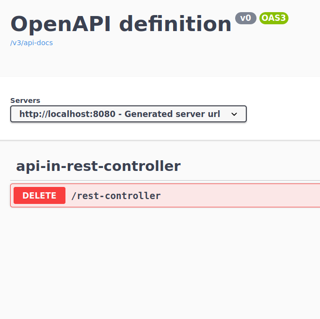

# demo-springdoc-no-content

> Demo project to show endpoints with HTTP 204 response in a @Controller are not displayed in the OpenAPI documentation

```bash
# launch webapp
mvn spring-boot:run&
# notice only the API from lin.louis.demo.ApiInRestController is displayed in the online documentation
# the API from lin.louis.demo.ApiInBasicController is not displayed
firefox http://localhost:8080/swagger-ui.html
```


